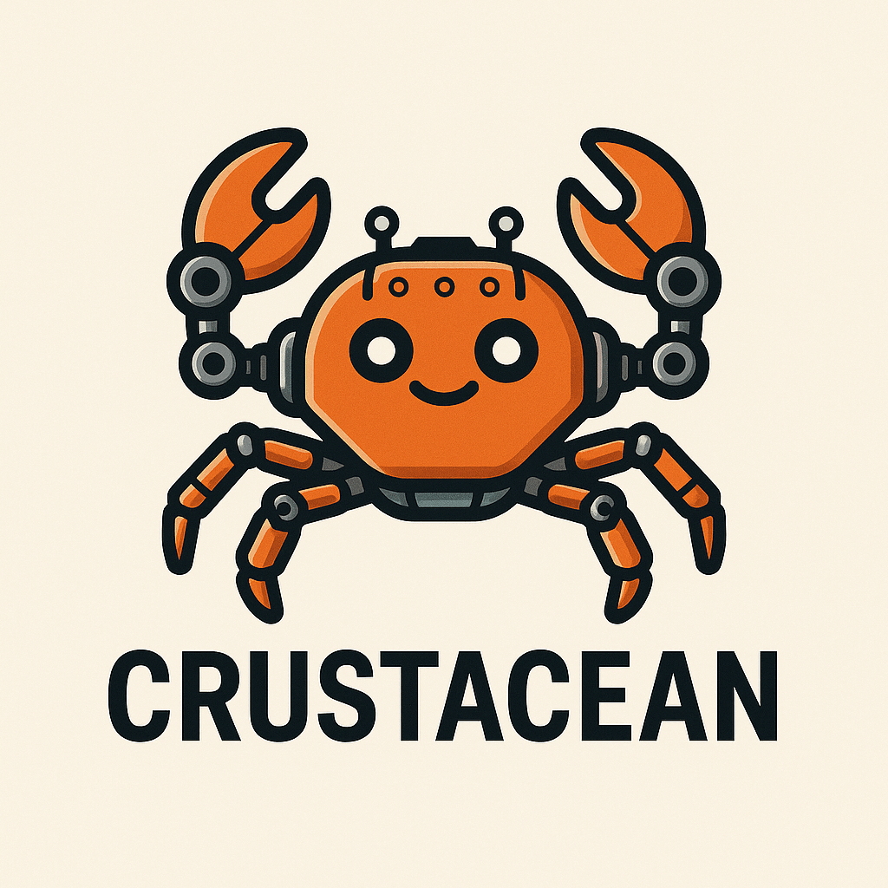

# 🦀 **Project Crustacian**

### **A cross-platform Rust CLI to install, update, and drive ClamAV + FreshClam on Windows, macOS, and Linux.**

---
  <p>
    
  </p>
---

## 🌐 Overview

**Crustacian** is an open-source, vendor-neutral command-line tool written in **Rust**, designed to simplify deployment and operation of the **ClamAV** antivirus engine across multiple operating systems.

It provides a consistent, secure, and predictable interface for:

* Installing ClamAV
* Managing FreshClam signature updates
* Running quick, full, or custom scans
* Viewing detailed results with throughput, progress, and ETA metrics
* Exporting structured logs for integration into SIEM/SOAR/automation pipelines

Crustacian is designed for **individuals, developers, sysadmins, SOC teams, and enterprise environments** where cross-platform consistency and automation matter.

---

## ✨ Features

| Capability                  | Description                                                             |
| --------------------------- | ----------------------------------------------------------------------- |
| **Cross-Platform**          | Works on Windows, macOS, and Linux distributions                        |
| **Installer Helper**        | Assists in installing ClamAV (local package managers or manual paths)   |
| **Signature Management**    | Runs FreshClam updates automatically or on demand                       |
| **Interactive Scan CLI**    | Quick / full / folder-targeted scans                                    |
| **Live Metrics**            | Progress %, files/sec, ETA, infected count, skipped files               |
| **Structured Logging**      | JSON + human-readable summary logs for automation systems               |
| **Config Management**       | Auto-generates safe default ClamAV and FreshClam configs                |
| **Extensible Architecture** | Designed for future modules (scheduling, remote scanning, local agents) |

---

## 🚀 Getting Started

### **Prerequisites**

* Rust **1.75+**
* Windows 10/11, macOS Ventura+, or any modern Linux distribution
* ClamAV installed (Crustacian can assist with this)

---

## 📥 Installation

### **Clone the repository**

```bash
git clone https://github.com/CharlesDerek/crustacian.git
cd crustacian
```

### **Build the CLI**

```bash
cargo build --release
```

The optimized binary will appear at:

```
target/release/crustacian
```

(Windows: `crustacian.exe`)

---

## 🧪 Usage

### **Start the interactive CLI**

```bash
./crustacian
```

You’ll see a menu similar to:

```
==================== Crustacian CLI ====================
1. Initialize / repair ClamAV environment
2. Update signatures (FreshClam)
3. Run a scan (quick / full / custom)
4. View previous scan results
5. Exit
```

### **Running a scan directly (non-interactive)**

*(Planned — see Roadmap)*

```
crustacian scan --path /home/user/downloads
crustacian scan --quick
crustacian scan --full
```

---

## 📂 Folder Structure

```
crustacian/
│
├── src/
│   ├── main.rs          # CLI entrypoint
│   ├── cli/             # Menus, argument parsing, UX
│   ├── platform/        # OS-specific ClamAV helpers
│   ├── scan/            # Scanner logic + metrics
│   └── logs/            # Logging utilities (structured output)
│
├── docs/                # Additional developer docs
└── README.md
```

---

## 🧠 Architecture Summary

Crustacian separates responsibilities into simple, testable modules:

* **Platform Layer**
  Detects OS, locates ClamAV binaries, validates config paths.

* **Signature Layer**
  Runs FreshClam, tracks update timestamps, and handles update failures.

* **Scan Engine Layer**
  Executes scans, tracks throughput, calculates ETA using adaptive models.

* **Logging & Output Layer**
  Stores results in both human-readable and structured JSON formats.

* **CLI Layer**
  Provides interactive and upcoming non-interactive interfaces.

This modular approach ensures Crustacian can be embedded into:

* Automation pipelines
* SIEM or SOAR workflows
* CI/CD environments
* Custom security tooling
* Endpoint agent frameworks

---

## 🔐 Security Considerations

Crustacian emphasizes:

* **No external telemetry**
* **No network connectivity except FreshClam updates**
* **No local persistence beyond logs/results**
* **No proprietary or closed-source components**
* **No remote execution or network scanning** (by design)

All operations are **local and transparent**.

---

## 🧭 Roadmap

Crustacian aims to remain lightweight, platform-agnostic, and transparent.
Upcoming milestones include:

### **Short Term**

* Non-interactive scan commands (`scan --full`, `scan --path`, etc.)
* Improved OS detection and ClamAV auto-installation helpers
* Enhanced logging (CSV, NDJSON, syslog integration)

### **Medium Term**

* Scheduled scan module
* Plugin-based output formatting
* Remote-report mode (print-only vs write-to-log modes)

### **Long Term**

* Distributed scanning API
* Local agent mode for large-scale fleet scenarios
* Optional sandboxing for file pre-processing before scan
* Pluggable detection layers (YARA support, heuristic pre-checks)

---

## 🤝 Contributing

Crustacian welcomes contributions that:

* Improve portability
* Enhance reliability
* Strengthen security
* Add vendor-neutral integrations
* Improve test coverage

---

## 📜 License

Crustacian is released under the **MIT License**.

This allows:

* Commercial use
* Modification
* Distribution
* Private or enterprise deployment

---

## ⭐ Support the Project

If Crustacian helps you secure your systems, please consider:

* Starring the repository
* Opening issues or feature requests
* Contributing improvements
